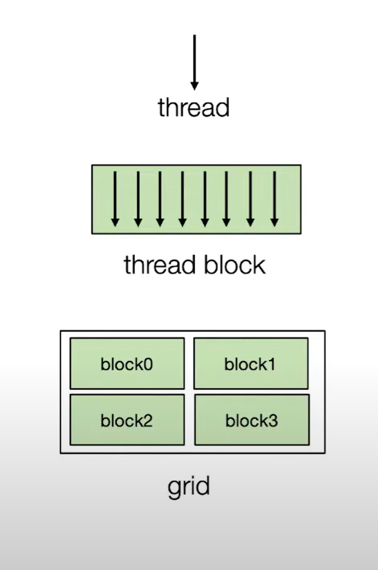

## L12. GPU Accel.

### Overview of GPU Programming


#### GPU Architecture:


#### GPU programming mode:SIMT,Single Instruction Multiple Threads

- All threads execute same code, but can take different path
- Threads are grouped into blocks, threads in the same block share same memory
- Blocks are grouped in a grid
- a kernel launch a grid
{height='400px'}

```c
__global__ void VecAddKernel(float* A,float* B,float* C,int n)
{
    int i=blockDim.x*blockIdx.x+threadIdx.x;
    if(i<n)
        C[i]=A[i]+B[i];
}
```

2blocks,4threads for each block:


CPU side:
- allocate data in GPU side(cudaMalloc)
- copy data in cpu memory to gpu(cudaMemcpy)
- init block num and block size,launch kernel on gpu side(VecAddKernel<<<num_of_blocks,threads_per_block>>>(params)  )
- copy data from gpu to cpu ,and free data


Note:bottleneck is often on data transmission between cpu and gpu,so **keep data on GPU as long as possible**

#### GPU memory hierarchy

- each thread run on a core with separate registers
- threads in a block use same shared memory, different block different shared memory
- every block on GPU share global memory


e.g. compute sum over a[i] to a[i+2r]

vanilla ver:
```c
int out_idx=blockDim.x*blockIdx.x+threadIdx.x;
if (out_idx<n)
{
    float sum=0;
    for(int dx=-r;dx<=r;dx++)sum+=a[out_idx+dx+r];
    b[out_idx]=sum;
}
```
(2r+1) loads from global memory for each element

Solution:cooperatively fetch memory from global mem to shared mem


```c
__shared__ float tmp[blockDim.x+2*r];// a base~base+blockDim+2r->tmp:0~blockDim+2r
int out_idx=blockDim.x*blockIdx.x+threadIdx.x;
int base=blockDim.x*blockIdx.x;
if(base+threadIdx.x<n)
{
    tmp[threadIdx.x]=A[base+threadIdx.x];
}
if(base+threadIdx.x+blockDim.x<n && threadIdx.x<2*r)
{
    tmp[threadIdx.x+blockDim.x]=A[base+threadIdx.x+blockDim.x];
}
__syncthreads();//ensure tmp is ready
if (out_idx<n)
{
    float sum=0;
    for(int dx=-r;dx<=r;dx++)sum+=tmp[out_idx+dx+r];
    b[out_idx]=sum;
}
```
blockDim>=2*r: at most 2 loads for each element 

### Case study: GEMM on GPU

vanilla version:
each thread is responsible for tiles V*V in C


memory load cnt: 2N^3/V,each thread loads 2NV

block tiling ver:
block responsible for L\*L ,each thread still V\*V


each thread load 2NV\^2/L from global mem to shared mem,and load 2NV times from shared to regs

