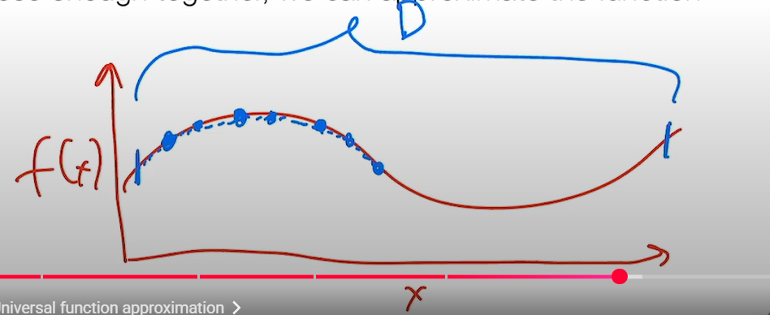

## Lecture3: Manual Neural Networks

#### 1.Nonlinear hypotheses

- Linear trouble:cannot classify things like xor/smileface
- One idea:create func $\phi(x):\R^n\to \R^d$that maps input space to different feature representations,$h_\theta(x)=\theta^T\phi(x)$
- How to determine func $\phi$
  - a.manually design $\phi$
  - b.learn from data ("new" way)
- Linear $\phi$ doesn't work,because it's still a linear classifier
- Nonlinear $\phi(x)$ like $\sigma(W^Tx) $,where $\sigma$ nonlinear, cannot be reduced to linear classifiers
  - e.g. W: fixed random Gaussian,$\phi$ : cosine func , "random Fourier"
  - work great,and parameters W/$\theta$ will be trained
  
#### 2.Neural Networks

- Definition: a particular type of hypothesis class,with multiple layers to form output
  - e.g. 2-layer neural network(shown before)
    - $h_\theta(x)=W_2^T\sigma(W_1^Tx)$
    - batch form:$h_\theta(X)=\sigma(XW_1)W_2$
- Thm 1: Universal function approximation: any function f can be approximated by 1-layer nn (Proof:select points close enough on f and let nn approximate points)
  
  - e.g. sum of (+-) relu functions and tune params to control turning points and slopes
- Fully-connected network:(N-layer cases):
  - $Z_{i+1}=\sigma_i (Z_iW_i),\\Z_1=X,\\
  h_\theta (X)=Z_{L+1},\\W_i \ \ \ :\ params$
- Advantage: more efficicent in representing functions,and empirically performs better

#### 3.Backprop

- 2-layer case:
$\triangledown_{\{W_1,W_2\}}l(\sigma(XW_1)W_2,y)$
  - for $W_2$, like softmax,grad=$\sigma(XW_1)^T \cdot (S-I_y)$,where S=norm(exp(h(x)))
  - for $W_1$,~~by dirty method(scalar deriv and dim alignment)~~,grad=$X^T(\sigma^`(XW_1)\circ (S-I_y)W_2^T)$   , where $\circ$ means element-wise product
- n-layer case:hard to derive directly in dirty method
- general case:backprop
- Form:$\frac{\partial l}{\partial W_i}=\frac{\partial l}{\partial Z_{l+1}}\frac{\partial Z_{l+1}}{\partial Z_l}...\frac{\partial Z_{i+1}}{\partial W_i}$
- $G_{L+1}=(S-I_y),\\G_i=\triangledown_{Z_i}l(Z_{L+1},y)=G_{i+1}\frac{\partial \sigma(Z_iW_i)}{\partial Z_i}=(G_{i+1}\circ \sigma^{'}(Z_iW_i))W_i^T$~~still by dirty method~~,$\triangledown_{W_i}l(Z_{L+1},y)=Z_i^T(G_{i+1}\circ \sigma^{'}(Z_iW_i))$
