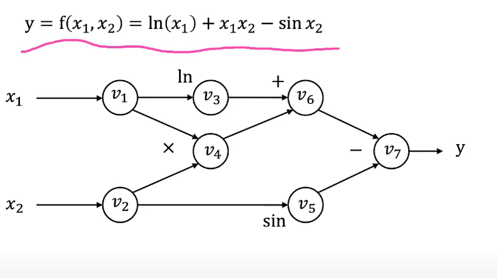
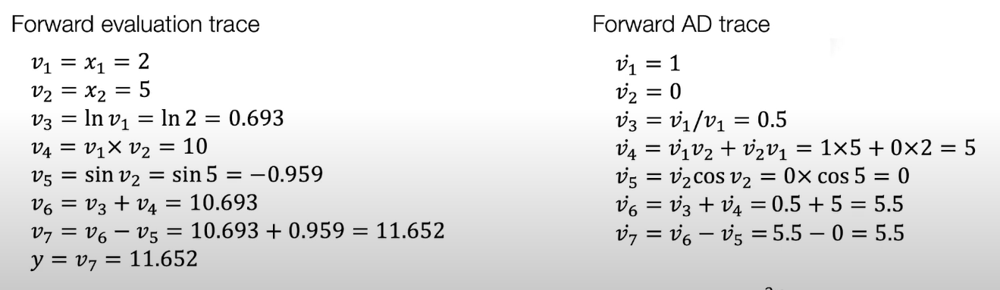
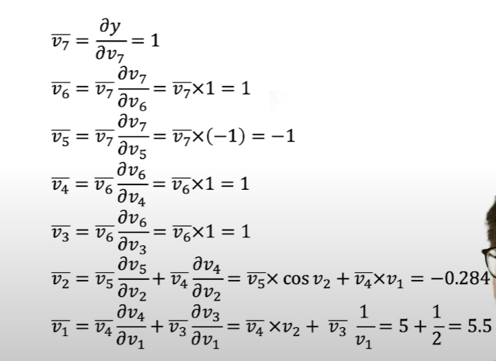
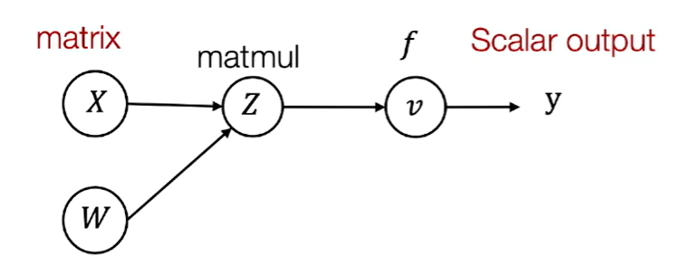
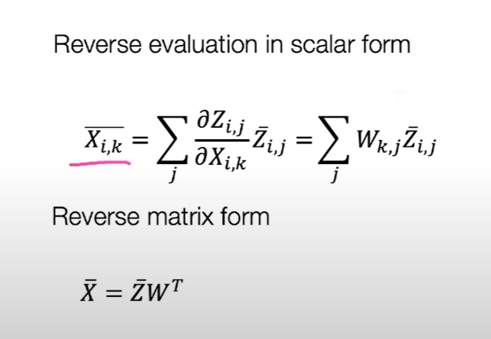
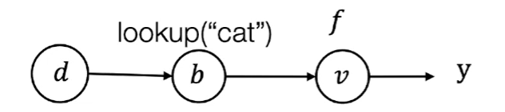

## Lecture4: Automatic Differentiation

#### 1.differentiation methods

- Numerical diff: calculate partial deriv by definition
  - $\frac{\partial f(\theta)}{\partial \theta_i}=\frac{f(\theta+\epsilon e_i)-f(\theta-\epsilon e_i)}{2\epsilon}+o(\epsilon^2)$
  - slow to compute,suffer from numeric error
  - often used to check correctness,i.e. pick random unit $\delta$ ,$\delta^T \triangledown_\theta f(\theta)=\frac{f(\theta+\epsilon \delta)-f(\theta-\epsilon \delta)}{2\epsilon}+o(\epsilon^2)$(change in direction $\delta$)
- Symbolic diff:derive diff formula for each param
  - wastes computation,e.g.$f(\theta)=\Pi \theta_i$ ,costs $n(n-2)$ mult

- Computational graph(important):nodes for intermediate values,edges for computation



- Forward AD:define $\dot v_i=\frac{\partial v_i}{\partial x_1}$,iterate in forward topological order



- Limitations of forward AD:forward separately for each input dim;inefficient for large n


#### 2.reverse mode autodiff


- Reverse AD:compute grad iteratively in backward topological order



- multiple path case:compute partial result(adjoints)separately in each path and then sum together(like v1, v2) 
  
```Python
def gradient(out):
  node_to_grad={out:[1]}
  for i in reverse_topo_order(out):
    vi_adj=sum(node_to_grad[i])
    for k in inputs(i):
      compute v_ktoi=vi_adj*(partial vi/partial vk)
      append v_ktoi to node_to_grad(k)
  return v_input_adj

```

- Difference with BP: BP manipulates in same forward graph,reverse AD creates new nodes for adjoint

- Reverse AD in tensors:likewise
- Define adjoint for tensor $\overline{Z}=\begin{bmatrix}
  \frac{\partial y}{\partial Z_{11}}...\frac{\partial y}{\partial Z_{1n}}\\
  .........\\
  \frac{\partial y}{\partial Z_{n1}}... \frac{\partial y}{\partial Z_{nn}}
\end{bmatrix}$





- Reverse AD on lookup mode:
e.g.$d=\{'cat':a_0,'dog':a_1\},\overline{d}=\{'cat':\frac{\partial y}{\partial a_0},'dog':otherwise\}$

