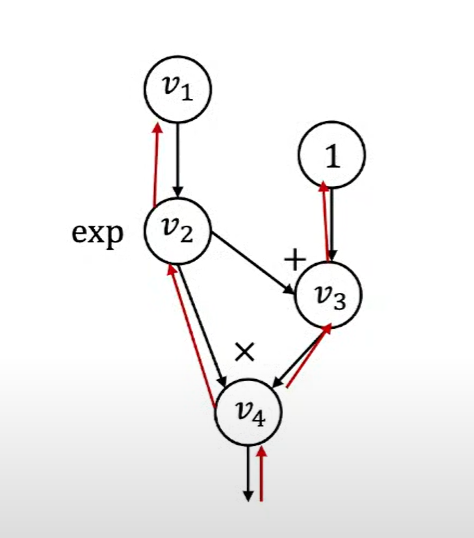
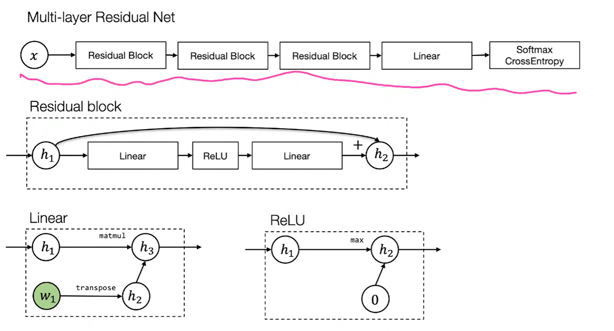

## L7. NN Library Abstractions

1. first generation:layer interface

```Python
class Layer:
    def forward(bottom,top):
        pass
    def backward(top,prop_down,bottom):#prop_down indicates whether to go to bottom
        pass
```

e.g.



it will represent operations as layers and combine in topological order


2. second generation:Tensorflow

Feature: have computational graph

first declare graph by ops,then execute graph forwaard by input val

```Python
v1=tf.Variable()
v2=tf.exp(v1)
v3=v2+1
v4=v2*v3
#no computation,just construct graph

sess=tf.Session()
v4_val=sess.run(v4,feed_dict={v1:np.array([1])})
#provide input and run
```

advantage:
- look at part of graph separately(e.g. care about v3, not v4)
- easy to optimize
- enable execution remotely

PyTorch: compute as we construct the graph
allow easy mix of control and computation

```Python
v1=ndl.Tensor([1])
v2=ndl.exp(v1)
v3=v2+1
v4=v2*v3
if v4.numpy() > 0.5:
    v5=v4*2
else:
    v5=v4
v5.backward()
```

more flexible, but relatively harder to optimize

----

ML abstraction

Recall:hypothesis func,loss func,optimizer

Problem: how to translate into modular components in code

Idea: DL is modular in nature




Solution:nn.Module(Tensor in ,Tensor out)

things to consider:
- how to compute outputs for given inputs
- include what (trainable) params and how to init

Loss func: Tensor in,scalar out(special module)

Optimizer:
- take in a list of model params
- perform update steps given grad
- keep track of momentums

Regularization:
- implement in loss func
- incorporate into optimizer in weight update$\\ w_i=(1-\alpha\lambda)w_i-\alpha g_i$

Initialization:

most nn libs have init routines:
- weight: uniform, magintude depends on input/output dim
- bias: 0

Data loader:

load data and randomly augment data (e.g. random shuffling and transformation)
k